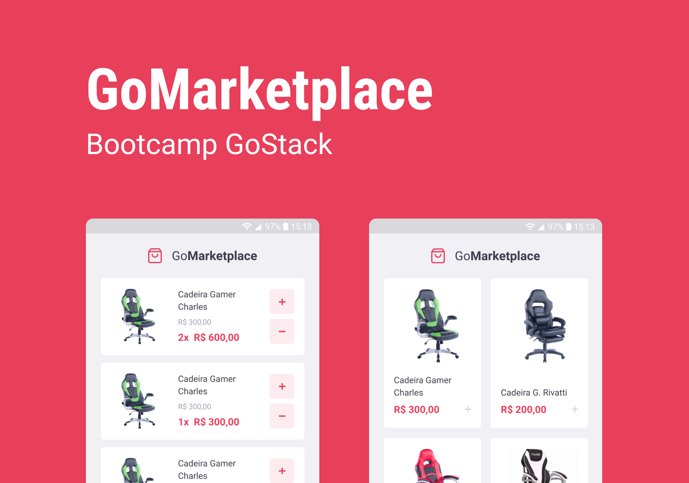

<p align="center">


<a href="https://www.linkedin.com/in/cintiazago/">
    
</a>

<a href="https://github.com/cintiazago/gomarketplace-mobile/commits/master">
    
</a>


</p>

<p align="center">

<a href="https://reactnative.dev/">
    
  </a>

</p>
<h2 align="center">
  Desafio 08: GoMarketplace Mobile
</h2>

## 🚀 Sobre o desafio

Neste desafio foi desenvolvida uma nova aplicação, a GoMarketplace. Desta vez foi colocado em prática conceitos do React Native juntamente com TypeScript, utilizando rotas, AsyncStorage e Context API.


## 🔨 Tecnologias:

- [React Native][reactnative]
- [TypeScript][typescript]
- [Axios][axios]


## 🚀 Como rodar este projeto

Para clonar e executar este aplicativo, você precisará de [Git](https://git-scm.com), [NodeJs][nodejs] e [React Native][reactnative] instalados em seu computador.

### 🌀 Clonando o repositório

```bash
# Clone este repositório
$ git clone https://github.com/cintiazago/gomarketplace-mobile

# Acesse a pasta do projeto no terminal/cmd
$ cd gomarketplace-mobile
```

### 📱 Rodando a aplicação Mobile

```bash
# Instale as dependências
$ yarn

# Instale as dependências IOS (somente se for usar IOS)
$ cd ios
$ pod install

# Execute a Aplicação Android (somente se for usar Android)
$ yarn android

# Execute a Aplicação IOS (somente se for usar IOS)
$ yarn ios

# Execute o teste da Aplicação
$ yarn test

# Execute a API Fake
$ yarn json-server server.json -p 3333 -H (Ip da sua maquina)

# O servidor inciará na porta:3333 - acesse http://localhost:3333
```

## 🛠 Funcionalidades da aplicação


- **`Listar os produtos da fake API`**: Sua página `Dashboard` deve ser capaz de exibir uma listagem através de uma tabela, com os campos `title`, `image_url` e `price`.

- **`Adicionar itens ao carrinho`**: Em toda sua aplicação, você deve utilizar o Contexto chamado `cart` que deixamos disponível. Você vai precisar completar as funcionalidades dentro de `hooks/cart.tsx` para que você consiga adicionar itens ao carrinho.

- **`Exibir itens do carrinho`**: Na página `Cart` você deve exibir todos os itens do carrinho, junto com a quantidade, valor único, valor subtotal dos itens e total de todos os items.

- **`Aumentar quantidade de itens do carrinho`**: Na página `Cart` você deve permitir que o usuário aumente a quantidade de itens do mesmo produto, para isso você pode utilizar a função `increment` dentro do seu contexto em `/src/hooks/cart.tsx`.

- **`Diminuir quantidade de um item do carrinho`**: Na página `Cart` você deve permitir que o usuário decremente a quantidade de itens do mesmo produto, para isso você pode utilizar a função `decrement` dentro do seu contexto em `/src/hooks/cart.tsx`.

- **`Exibir valor total dos itens no carrinho`**: Tanto na página `Dashboard`, tanto na página `Cart` você deve exibir o valor total de todos os itens que estão no seu carrinho.


## 🤔 Como contribuir para o projeto

- Faça um **fork** do projeto;
- Crie uma nova branch com as suas alterações: `git checkout -b my-feature`
- Salve as alterações e crie uma mensagem de commit contando o que você fez:`git commit -m "feature: My new feature"`
- Envie as suas alterações: `git push origin my-feature`

> Caso tenha alguma dúvida confira este [guia de como contribuir no GitHub](https://github.com/firstcontributions/first-contributions)

## 📝 Licença

Este projeto esta sobe a licença MIT. Veja a [LICENÇA][license] para saber mais.

Feito com ❤️ por Cintia Zago 👋🏽 [Entre em contato!](https://www.linkedin.com/in/cintiazago/)

[nodejs]: https://nodejs.org/
[reactnative]: https://reactnative.dev/
[express]: https://expressjs.com/
[uuidv4]: https://www.npmjs.com/package/uuidv4
[nodemon]: https://www.npmjs.com/package/nodemon
[rs]: https://rocketseat.com.br
[license]: https://opensource.org/licenses/MIT
[Postgres]: https://www.postgresql.org/
[Multer]: https://www.npmjs.com/package/multer
[reactjs]: https://reactjs.org/
[axios]: https://www.npmjs.com/package/axios
[babel]: https://babeljs.io/
[webpack]: https://webpack.js.org/
[rs]: https://rocketseat.com.br
[license]: https://opensource.org/licenses/MIT
[typescript]: https://www.typescriptlang.org/
